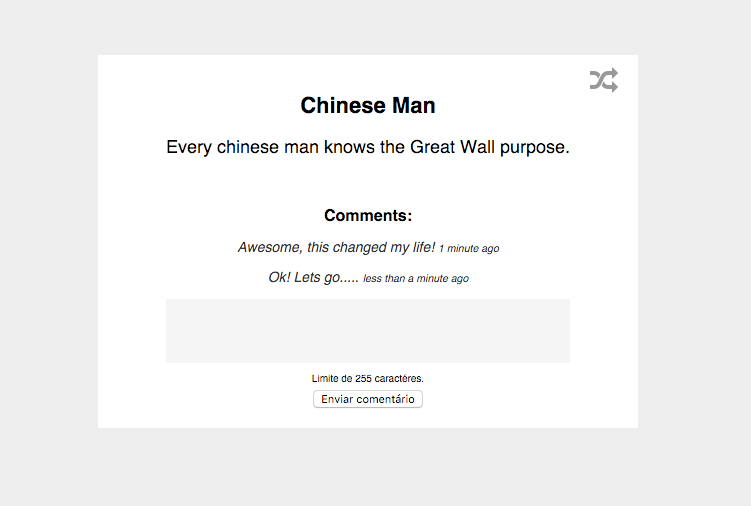

## Coding challenge ⚡️

This challenge aims to test your backend and frontend skills, it was designed
for the typical full stack Rails developer.

### Briefing 📜

You are supposed to build a website which shows random "fortune" messages, just
like the one you find in fortune cookies. Note that our fortune messages also
include a title.

Each fortune message may receive anonymous comments, the comment must be at
least 10 character long and at most 255 characters long.

We don't believe you will be needing any layouts (.psd) to complete this test.

You should follow the following screen design:

### Requirements ⚒

There is only one techical requirement when building this app.

* It must be done in Ruby on Rails

Other than that you are free to use any tools you like, we encourage you to
built it with what you are most confortable with.

### Why the hell is this test so simple? 🙈 

We believe this test is just like making pizza, pizza is simple, it is just
water, flour, salt and yeast; with some tomato sauce and cheese. This is why
every single ingredient is so important, and makes such a huge difference on
the end result.

### Demo 🐮

We have already done this coding challenge ourselves, this video demonstrates
how the website should work.

[Video](resources/demo.mp4)

